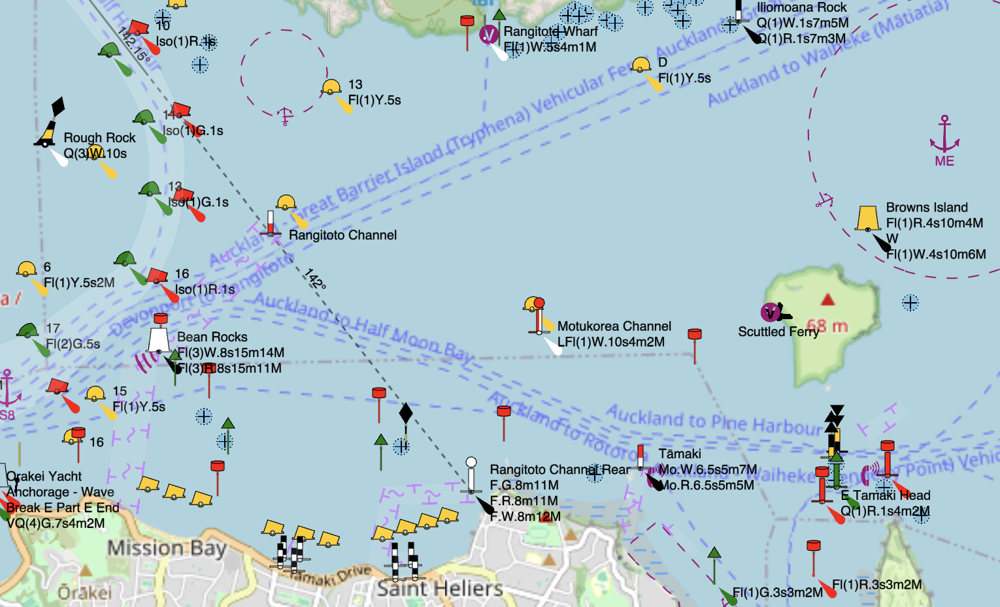
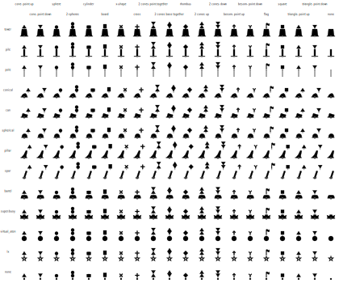
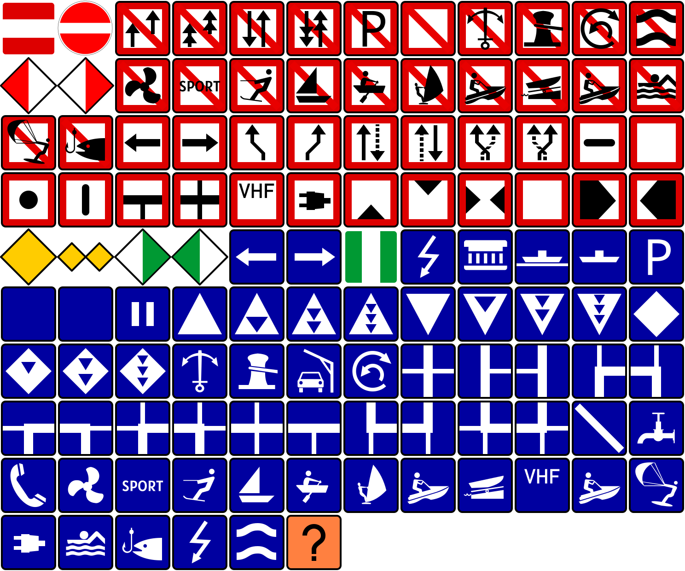

# OpenSeaMap-vector

[OpenSeaMap<b>-vector</b>](https://kyle.kiwi/OpenSeaMap-vector) is rewrite of [OpenSeaMap<b>.org</b>](https://OpenSeaMap.org), using [vector tiles](https://en.wikipedia.org/wiki/Vector_tiles) instead of [raster tiles](https://osm.wiki/Raster_tiles).
Inspired by [OpenRailwayMap<b>.app</b>](https://OpenRailwayMap.app) (a vector rewrite of [OpenRailwayMap<b>.org</b>](https://OpenRailwayMap.org)).

## Architecture

TODO

## navmark-renderer

Navigation marks require a huge number of OSM tags to be accurately described, in extreme cases [>250 tags](https://osm.org/node/1211591064) are required on a single node.

Since it's impossible to pre-generate icons for every possible combination, SVG icons for navigational marks are rendered on-the-fly in the browser.

The following unit test snapshots show the complexity involved, just for a small part of the process ([buoys](https://osm.wiki/Seamarks/Buoys), [beacons](https://osm.wiki/Seamarks/Beacons), and [topmarks](https://osm.wiki/Seamarks/Topmarks_and_Daymarks)):

For [notices](https://osm.wiki/Seamarks/CEVNI_Notice_Marks) (traffic signs), the SVG templates define the coordinates where the text should be placed, and this text is drawn using [an HTML `<canvas />`](https://developer.mozilla.org/en-US/docs/Web/API/Canvas_API):

| Templates                                                                           | Rendered with text                                                                                                          |
| ----------------------------------------------------------------------------------- | --------------------------------------------------------------------------------------------------------------------------- |
|  |  |

# Usage

Besides from [viewing the map](https://kyle.kiwi/OpenSeaMap-vector), various parts of this project could be re-used in your own app.

- **osm.pbf:** You can download a slimmed-down version of the osm planet file from our CDN, which only contains [`seamark:*`](https://osm.wiki/Seamarks/Seamark_Objects) and [some other tags](./data/osmium-tags-filter.ini). This file is only 40 MB, unlike the entire planet which is 80 GB. [Download Link](https://cdn-oceania-07.kyle.kiwi/seamarks.pbf).
- **maplibre-gl style:** You could _theoretically_ use the maplibre style JSON file in any other [maplibre](https://maplibre.org)-based map. For example, [in Overpass-Ultra](https://overpass-ultra.us/#run&m=13.79/-36.8330/174.7941&q=LQhQGcBcE8BsFMBcoAEL4A9LwHYBNxEUALSSAB0IHoqBrOeAOloEsB3FqgeXNwGV4AQwCyg8sABu8AMaQA9gCcqUBowBW4OTlCgQwUEA). [Download Link](https://kyle.kiwi/OpenSeaMap-vector/style.json). However, navigational marks won't render correctly, since they need to be generated on-the-fly with the [navmark-renderer](#navmark-renderer) JS library.
- **navmark-renderer:** this is an NPM library that could be re-used anywhere. See the [section above](#navmark-renderer).

This app is still an early prototype, so all of these resources are subject to change without a prewarning. Use at your own risk.

# Contributing

To edit the code for this project on your own computer:

- Install [Docker](https://docker.com).
- Install [NodeJS](https://nodejs.org).
- If you plan to edit the Java files, follow [planetiler's instructions](https://github.com/onthegomap/planetiler/blob/main/CONTRIBUTING.md) for installing Java and setting up your IDE.
- To generate the vector tiles:
  - change the URL in [planet.sh](./planet.sh) to [your local region](https://download.geofabrik.de).
  - run `. ./planet.sh`
  - run `. ./tiles.sh`
  - now you have tiles in [./data/public](./data/public) folder!
- To run the website:
  - run `. ./sprite.sh`
  - run `cd packages/navmark-renderer`
    - run `npm install`
    - run `npm run build`
    - run `cd ../..`
  - run `cd packages/website`
  - run `npm install`
  - run `npm start`
  - Open [localhost:1673](http://localhost:1673) in your browser.

# License

- The map data is sourced from [OpenStreetMap](https://osm.org) and licensed under the [ODbL license](https://osm.org/copyright).
- The code and icons in _this repository_ licensed under [Creative Commons CC0 license](https://wikidata.org/wiki/Wikidata:Copyright). Many icons are copied from other CC0-licensed projects, such as [Temaki](https://github.com/rapideditor/temaki) and selective icons from [Wikimed](https://commons.wikimedia.org/wiki/Category:SVG_Nautical_Chart_icons)[ia Commons](https://commons.wikimedia.org/wiki/Category:CEVNI_signs_by_function).
